# Nester Voice AI Bot - Project Overview

## Project Description
A multi-user voice AI assistant for Nesterlabs that answers questions about the company, services, projects, and helps visitors connect with the team using conversational AI.

---

## 🛠️ Technologies & Tools Used

### **Backend Framework**
- **FastAPI** (Python 3.11)
  - Async web framework for handling HTTP and WebSocket connections
  - Serves REST API endpoints (`/health`, `/status`, `/connect`)
  - Manages WebSocket connections for real-time voice communication

### **Voice AI Pipeline**
- **Pipecat Framework (v0.0.97)**
  - Real-time voice pipeline orchestration
  - Handles STT → LLM → TTS flow
  - Frame-based processing for low latency

### **Speech-to-Text (STT)**
- **Deepgram API**
  - Model: `nova-3` (latest, most accurate)
  - Real-time streaming transcription
  - Features: smart formatting, punctuation, filler word removal
  - Endpointing: 300ms for fast response

### **Text-to-Speech (TTS)**
- **Deepgram TTS**
  - Voice: `aura-2-athena-en` (natural female voice)
  - Encoding: linear16 (high quality)
  - Sample rate: 24kHz
  - WebSocket streaming for low latency

### **Large Language Model (LLM)**
- **Google Gemini**
  - Model: `gemini-2.5-flash`
  - Temperature: 0.8 (natural conversation)
  - Max tokens: 256 (concise voice responses)
  - Function calling for RAG integration

### **Knowledge Base (RAG)**
- **LightRAG**
  - External API: `http://16.170.172.18`
  - Mode: `global` (comprehensive context)
  - Streaming: enabled for faster retrieval
  - Documents: 7 company documents (overview, services, projects, etc.)
  - API Key authentication

### **Frontend**
- **TypeScript** with Vite build system
- **RTVI Client** (`@pipecat-ai/client-js`)
  - WebSocket transport for voice communication
  - Real-time audio streaming
  - Device management (mic/speaker selection)

### **Containerization**
- **Docker** with Docker Compose
  - Multi-container setup
  - Isolated services (backend, frontend, proxy)
  - Volume management for SSL certificates

### **Reverse Proxy & SSL**
- **Caddy Server**
  - Automatic HTTPS via Let's Encrypt
  - WebSocket proxying
  - Security headers
  - Gzip compression

### **CI/CD**
- **GitHub Actions**
  - Auto-deploy on push to `main` branch
  - SSH deployment to Lightsail
  - Container rebuild and restart
  - Environment variable management

### **Additional Libraries**
- **loguru** - Enhanced logging
- **python-dotenv** - Environment variable management
- **httpx** - Async HTTP client for RAG API
- **pydantic** - Data validation
- **PyYAML** - Configuration management

---

## 🚀 Deployment Architecture

### **Cloud Platform**
- **AWS Lightsail**
  - Instance type: 2 GB RAM, 1 vCPU
  - Region: `ap-south-1` (Mumbai, India)
  - OS: Ubuntu 22.04 LTS
  - Public IP: `3.6.64.48`

### **Domain & DNS**
- **nip.io** (Free wildcard DNS)
  - Domain: `3.6.64.48.nip.io`
  - Automatically resolves to the IP address
  - HTTPS enabled via Caddy

### **Container Architecture**

```
┌─────────────────────────────────────────┐
│  Internet (HTTPS/WSS)                   │
└──────────────┬──────────────────────────┘
               │ Port 443/80
               ▼
┌──────────────────────────────────────────┐
│  Caddy (Reverse Proxy)                   │
│  - Automatic SSL/TLS                     │
│  - Routes: /ws, /health, /connect, /     │
└──────┬───────────────────────┬───────────┘
       │                       │
       │ Port 7860            │ Port 80
       ▼                       ▼
┌──────────────────┐   ┌──────────────────┐
│  Backend         │   │  Frontend        │
│  (FastAPI)       │   │  (Nginx)         │
│  - WebSocket     │   │  - Static HTML   │
│  - Voice AI      │   │  - TypeScript    │
│  - RAG API       │   │  - RTVI Client   │
└──────────────────┘   └──────────────────┘
       │
       │ HTTP Request
       ▼
┌──────────────────────────────────────────┐
│  LightRAG API (External)                 │
│  IP: 16.170.172.18                       │
│  - Knowledge Base                        │
│  - Global mode queries                   │
└──────────────────────────────────────────┘
```

### **Docker Containers**

1. **nester-backend**
   - Image: Custom Python 3.11
   - Exposed port: 7860 (HTTP + WebSocket)
   - Memory: 400MB limit, 200MB reserved
   - Health check: `curl http://localhost:7860/health`
   - Note: Port 8765 defined but NOT used (FastAPI mode uses port 7860 for everything)

2. **nester-frontend**
   - Image: nginx:alpine
   - Exposed port: 80
   - Memory: 50MB limit, 10MB reserved
   - Serves static HTML/JS/CSS

3. **nester-caddy**
   - Image: caddy:2-alpine
   - Ports: 80 (HTTP), 443 (HTTPS)
   - Memory: 100MB limit, 20MB reserved
   - Volumes: SSL certificates, Caddy config

### **Networking**
- Docker network: `nester-network` (bridge mode)
- Internal service communication via container names
- Only Caddy exposes ports to internet

---

## 📂 Project Structure

```
NesterConversationalBot/
├── app/
│   ├── api/
│   │   ├── routes.py              # /health, /status, /connect endpoints
│   │   └── websocket.py           # WebSocket handler
│   ├── config/
│   │   ├── config.yaml            # Main configuration
│   │   └── loader.py              # Config loader with env substitution
│   ├── core/
│   │   ├── connection_manager.py  # Multi-user session management
│   │   ├── server.py              # Voice assistant server
│   │   └── voice_assistant.py     # Pipeline orchestration
│   └── services/
│       ├── conversation.py        # LLM conversation manager
│       ├── rag.py                 # RAG service (LightRAG)
│       ├── stt.py                 # Speech-to-Text service
│       └── tts.py                 # Text-to-Speech service
│
├── client/
│   ├── src/
│   │   ├── app.ts                 # Main TypeScript application
│   │   └── style.css              # Frontend styles
│   ├── index.html                 # Main HTML page
│   ├── Dockerfile                 # Frontend container
│   └── nginx.conf                 # Nginx configuration
│
├── data/                          # Persistent data (RAG, logs)
├── .github/
│   └── workflows/
│       └── deploy.yml             # GitHub Actions CI/CD
│
├── docker-compose.https.yml       # Production deployment config
├── Dockerfile                     # Backend container
├── Caddyfile                      # Reverse proxy config
├── requirements.txt               # Python dependencies
└── .env                           # Environment variables (secrets)
```

---

## 🔑 Environment Variables

### **API Keys** (stored in `.env` and AWS Parameter Store)
- `GOOGLE_API_KEY` - Google Gemini LLM
- `LIGHTRAG_API_KEY` - LightRAG knowledge base
- `DEEPGRAM_API_KEY` - Speech services (STT + TTS)
- `ELEVENLABS_API_KEY` - Alternative TTS (not currently used)
- `OPENAI_API_KEY` - Alternative LLM (not currently used)
- `PINECONE_API_KEY` - Alternative RAG (not currently used)

### **Configuration**
- `PUBLIC_URL` - `https://3.6.64.48.nip.io`
- `DOMAIN` - `3.6.64.48.nip.io`
- `WEBSOCKET_SERVER` - `fast_api` (**IMPORTANT**: Uses FastAPI WebSocket on port 7860, NOT standalone server on port 8765)
- `SESSION_TIMEOUT` - `180` seconds
- `LOG_LEVEL` - `INFO`

---

## 🌐 Endpoints & URLs

### **Public URLs**
- **Frontend**: https://3.6.64.48.nip.io/
- **Health Check**: https://3.6.64.48.nip.io/health
- **Status**: https://3.6.64.48.nip.io/status
- **WebSocket**: wss://3.6.64.48.nip.io/ws

### **Internal Services**
- Backend HTTP & WebSocket: `http://backend:7860` (FastAPI handles both)
- Frontend: `http://frontend:80`
- LightRAG API: `http://16.170.172.18`

### **WebSocket Architecture**
- **Mode**: FastAPI integrated WebSocket (NOT standalone server)
- **Port**: 7860 (same port for HTTP and WebSocket)
- **Path**: `/ws` (handled by FastAPI)
- **Advantage**: Native async support for concurrent connections
- **Deprecated**: Port 8765 standalone WebSocket server is NOT used

---

## 🔄 Deployment Workflow

### **Automatic Deployment (GitHub Actions)**

```mermaid
graph LR
    A[Push to GitHub] --> B[GitHub Actions Triggered]
    B --> C[SSH to Lightsail]
    C --> D[Git Pull Latest Code]
    D --> E[Fetch Secrets from AWS]
    E --> F[Update .env File]
    F --> G[Rebuild Docker Images]
    G --> H[Restart Containers]
    H --> I[Reload Caddy Config]
    I --> J[Deployment Complete]
```



### **Manual Deployment Steps**

1. **SSH to Server**
   ```bash
   ssh ec2-user@3.6.64.48
   cd /home/ec2-user/nester-bot
   ```

2. **Update Code**
   ```bash
   git pull origin main
   ```

3. **Rebuild & Restart**
   ```bash
   export DOMAIN=3.6.64.48.nip.io
   sudo -E docker-compose -f docker-compose.https.yml up -d --force-recreate
   ```

4. **Check Logs**
   ```bash
   sudo docker logs nester-backend --tail 50 -f
   ```

---

## 🎯 Key Features

### **Multi-User Support**
- Handles up to **20 concurrent users**
- Session tracking with unique IDs
- Connection capacity management
- Heartbeat monitoring (30-second intervals)

### **Voice Conversation Flow**
1. User speaks → Deepgram STT transcribes
2. Text sent to Gemini LLM
3. LLM decides: direct answer OR call RAG
4. If RAG needed: query LightRAG API
5. LLM synthesizes concise response
6. Deepgram TTS generates audio
7. Audio streamed to user

### **RAG Integration**
- **Global mode**: Comprehensive context understanding
- **Streaming enabled**: Faster retrieval
- **Thinking phrases**: User feedback during RAG queries
- **Concise synthesis**: Long RAG responses condensed to 1-3 sentences

### **Custom System Prompt**
- Nesterlabs-specific personality
- Warm, professional tone
- Business outcome focus
- Contact information ready (email, phone)

---

## 📊 Performance Metrics

- **Connection Setup**: ~2 seconds
- **STT Transcription**: ~0.2-0.5 seconds (real-time)
- **LLM Response**: ~1 second (without RAG)
- **RAG Query**: ~5-8 seconds (global mode)
- **TTS Generation**: ~0.3 seconds
- **End-to-End Latency**: ~3-4 seconds (direct), ~9-10 seconds (with RAG)

---

## 🔒 Security Features

- **HTTPS Only**: Automatic SSL via Caddy/Let's Encrypt
- **API Key Authentication**: All external APIs require keys
- **Environment Variables**: Secrets not in code
- **Docker Isolation**: Services run in isolated containers
- **Security Headers**: X-Frame-Options, CSP, XSS protection
- **Rate Limiting**: Connection capacity limits

---

## 📝 Configuration Files

### **Main Config**: `app/config/config.yaml`
- Language settings
- STT/TTS providers and models
- LLM configuration
- RAG settings (mode, streaming, timeout)
- System prompt (Nesterlabs instructions)
- VAD parameters

### **Docker Compose**: `docker-compose.https.yml`
- Service definitions
- Environment variables
- Volume mappings
- Network configuration
- Health checks
- Resource limits

### **Caddyfile**: Reverse proxy rules
- Domain configuration
- Route handlers (`/ws`, `/health`, etc.)
- HTTPS settings
- Compression
- Security headers

---

## 🧪 Testing & Monitoring

### **Health Checks**
- Backend: `GET /health` (every 30 seconds)
- Response: `{"status": "healthy"}`

### **Logging**
- **Backend logs**: `docker logs nester-backend`
- **Frontend logs**: `docker logs nester-frontend`
- **Caddy logs**: `docker logs nester-caddy`
- Format: Structured JSON with timestamps

### **Monitoring Tools**
- Docker stats: `docker stats --no-stream`
- Connection count: Via `/status` endpoint
- Session tracking: Logged per connection

---

## 🚦 Current Status

✅ **Deployed**: https://3.6.64.48.nip.io
✅ **Multi-user**: Up to 20 concurrent connections
✅ **RAG**: Global mode with streaming enabled
✅ **CI/CD**: Auto-deploy on git push
✅ **SSL**: HTTPS with automatic certificate renewal
✅ **System Prompt**: Nesterlabs-specific instructions active

---

## 📞 Support & Contact

**Technical Stack**: Python, FastAPI, Docker, TypeScript, Pipecat
**Deployment**: AWS Lightsail, Caddy, GitHub Actions
**AI Services**: Google Gemini, Deepgram, LightRAG
**Repository**: https://github.com/akkupratap323/NesterVoiceAI

---

**Last Updated**: December 17, 2025
**Version**: 2.0 (Multi-user with RAG global mode)
